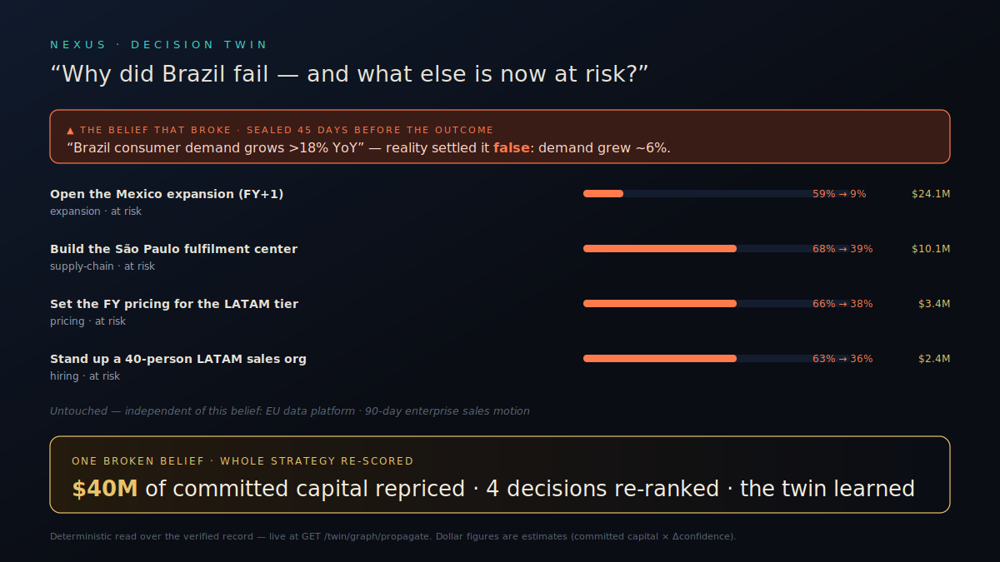

# NEXUS — The Decision Twin

> **The decision twin enterprise strategy teams can actually check.**
> It remembers how your company decides, verifies every call against reality, and
> re-scores your entire strategy the moment an assumption breaks.

NEXUS is one product, for one buyer, with one unforgettable moment.

| | |
|---|---|
| **What it is** | A living Decision Twin for an enterprise strategy team. |
| **Who it's for** | Heads of Strategy, Corporate Development, and the strategy office at large enterprises. |
| **Why it matters** | Strategy fails silently. NEXUS makes the assumptions under every bet explicit, watches reality settle them, and tells you what to change *before* the next quarter does. |
| **Why now** | Every team now has GPT. None of them can prove a forecast was made before the outcome, or learn from whether it was right. That's the gap NEXUS owns. |

---

## The 10-second value proposition

**Ask your strategy a question. Get an answer that remembers, verifies, and improves.**

## The 30-second pitch

Enterprise strategy teams make hundred-million-dollar bets on assumptions nobody writes
down. When the bet fails, no one can say *which* belief broke, or what else is now
standing on it. NEXUS builds a **Decision Twin**: it captures every strategic decision and
the assumptions it rests on, seals each one on the record *before* the outcome exists,
and verifies it against reality. When an assumption is falsified, NEXUS propagates that
single fact across the whole **Decision Graph** — dropping confidence, re-ranking
recommendations, and updating the strategy in real time. ChatGPT answers and forgets.
The Decision Twin remembers, verifies, and compounds. The longer it runs, the harder it
is to live without.

---

## The customer journey

```
  Decision Twin ─▶ Decision Graph ─▶ Future Explorer ─▶ Reality Verification ─▶ Decision Timeline ─▶ Organizational Learning
   capture how      connect every      reason about a      seal & check it          show what          the twin gets
   the org decides   decision to its    decision before     against reality          changed today      sharper, forever
                     assumptions        you commit
```

You meet the product as five capabilities, woven together by **Organizational
Learning** — the loop that makes them compound. Nothing else.

| Capability | What the strategy team gets | Endpoint |
|---|---|---|
| **Decision Twin** | The living state of how the org decides, with one **Decision Confidence**. | `GET /twin` |
| **Decision Graph** | Every decision wired to the assumptions, evidence, and outcomes it depends on — and it's **alive**. | `GET /twin/graph`, `GET /twin/graph/propagate` |
| **Future Explorer** | Put an executive decision in, get best/worst/expected outcomes, the assumptions that matter, and a recommended action. | `GET /twin/futures` |
| **Reality Verification** | Every decision sealed before its outcome and checkable on a stranger's phone. | `GET /twin/verification` |
| **Decision Timeline** | Opens with **"What's changed today?"** — the reason an executive returns every morning. | `GET /twin/timeline` |

---

## The "aha" — one broken assumption re-scores the whole strategy

> **CEO:** *Why did we fail in Brazil — and what else is now at risk?*
>
> **Decision Twin:** The Brazil launch was sealed on one load-bearing belief —
> *"Brazil consumer demand grows >18% YoY."* Reality settled it false: demand grew ~6%.
> **Four other decisions** were standing on that same belief — and counting the failed
> Brazil launch itself, **$126M of committed capital** rode on it. Those four open
> decisions just dropped their confidence. Here is what to change, ranked by business
> impact, with the exposure each change re-prices:
>
> 1. **Hold the Mexico expansion** — it inherits the same demand thesis. *(impact 63 · ~$24.1M repriced)*
> 2. **Pause the São Paulo fulfilment center** — switch to a 3PL until demand re-clears. *(38 · ~$10.1M)*
> 3. **Reprice the LATAM tier** to the lower-demand band. *(33 · ~$3.4M)*
> 4. **Freeze the LATAM sales backfill** — convert to a demand-triggered ramp. *(26 · ~$2.4M)*
>
> The EU platform and the sales-motion change don't depend on this belief, so they're
> untouched. **One broken belief → ~$40M of strategy re-priced.** And the twin learned:
> this assumption's falsification rate rose, so every future strategy that leans on it
> now inherits lower confidence automatically.



*(Open [`demo/cascade.svg`](demo/cascade.svg) in a browser to watch the cascade animate.
Dollar figures are estimates — committed capital × the drop in each decision's survival
probability — labeled as such in the API, never invented precision.)*

This isn't a slide. It's a live endpoint (`/twin/graph/propagate`) and a one-screen
animation (`nexus-landing/standalone/decision-graph.html`). Every recommendation reads
like an executive memo — action, reason, dollar impact, why-now, evidence, and the
**alternative** to take instead (`demo/recommendation-card.svg`). One falsified belief,
the entire connected strategy re-scored in front of you. **That is the moment judges
remember.**

---

## Why not ChatGPT?

| | ChatGPT | **Decision Twin** |
|---|---|---|
| Organizational memory | forgets after the chat | **remembers every decision and the belief it rested on** |
| Verification | cannot prove a call predated its outcome | **every decision sealed before reality, checkable by a stranger** |
| Learning | static weights | **bends toward what actually happened, decision by decision** |
| Compounding | none | **every verified outcome makes the next recommendation sharper** |

A general model answers a question. The Decision Twin owns your organization's decision
record — and that record is the one thing a competitor cannot generate, buy, or backfill.

---

## Measurable enterprise outcomes

NEXUS is instrumented to move the numbers a strategy office is judged on:

| Outcome | Before NEXUS | With NEXUS (target) |
|---|---|---|
| Strategic review prep time | days of deck-building | **~70% faster** — the twin assembles the decision, assumptions, and status |
| "Which decisions are at risk *right now*?" | nobody knows until the QBR | **answered every morning** by the Decision Timeline |
| Assumption coverage | implicit, undocumented | **100% of sealed decisions carry named, tracked assumptions** |
| Decision traceability / audit readiness | reconstructed after the fact | **every decision provably sealed before its outcome** |
| Forecast verification rate | unmeasured | **continuously scored against external reality** |
| Knowledge retention across the team | walks out the door | **persists in the twin** |

---

## The flywheel (why year three is unbeatable)

```
        Decision ─▶ Reality Verification ─▶ Organizational Learning
            ▲                                          │
            │                                          ▼
   Higher switching cost ◀─ Better recommendations ◀─ Sharper Decision Twin
            ▲                                          │
            │                                          ▼
        More usage ◀───────── More verified decisions ─┘
```

Every verified decision sharpens the twin, which makes recommendations better, which
drives more usage, which seals more decisions — and the switching cost rises with every
turn. **The moat is not the technology. It's the compounding record of verified
enterprise decisions, and the organizational memory built on top of it.**

---

## Why AWS is essential (every service earns its place)

NEXUS is not "an AI app that happens to run on AWS." Remove any one of these and a core
capability stops:

| Business capability | AWS service | Why it's essential |
|---|---|---|
| Enterprise reasoning over a decision | **Bedrock** | the multi-model panel that reasons each decision and its assumptions |
| Continuous verification | **EventBridge** | schedules reality checks — assumptions get settled without a human |
| Autonomous execution | **Lambda** | settles outcomes and propagates the cascade on its own |
| The living Decision Graph | **DynamoDB** | stores the decisions, assumptions, and edges the graph walks |
| Immutable evidence | **S3 Object Lock** | a decision, once sealed, cannot be backdated — even by us |
| Enterprise observability | **CloudWatch** | every settlement and propagation is auditable |
| Governance & security | **IAM · Secrets Manager · KMS** | the controls a CIO requires |

> *(The model layer is provider-agnostic: production reasons via Bedrock or any OpenAI-compatible endpoint; the zero-key offline demo uses a deterministic local reasoner so it always runs — the differentiated value is the verified record, propagation, simulation, and calibration, not the model.)*

> Bedrock is the demo; the verified decision record is the business — and the autonomous
> verify-and-learn loop only exists because EventBridge + Lambda + S3 Object Lock run it.

---

## See it in 30 seconds (no AWS, no keys)

```bash
cd backend
pip install -r requirements.txt
python run_demo.py                  # serves http://localhost:8000, seeds the scenario
```

```bash
# the five capabilities, plus the aha:
curl localhost:8000/twin                      # Decision Twin + Decision Confidence
curl localhost:8000/twin/graph/propagate      # ◀ the aha — one broken assumption, re-scored strategy
curl "localhost:8000/twin/futures?decision=Should%20we%20open%20Mexico%20next%3F"
curl localhost:8000/twin/timeline             # "What's changed today?"
curl localhost:8000/twin/verification         # the phone-verifiable proof
```

Then open the experience:

```
nexus-landing/standalone/index.html?api=http://localhost:8000
└─ decision-graph.html   ◀ the aha: watch the cascade
   arena.html            human vs AI, scored live
   verify.html           recompute a seal's hash on your own phone
```

---

## The honesty invariant (this is the credibility, not a caveat)

A fresh twin reports **0 verified outcomes** and says so. NEXUS never fabricates
foresight: decisions are sealed now and stay open until reality settles them; Decision
Confidence is unscored until real outcomes exist; the demo's verified failure was sealed
before its outcome, by an oracle the team does not control. The product is honest by
construction — that is exactly why an enterprise can trust it.

---

## Repository map

```
nexus-decision-twin/
├── README.md            ← you are here (product)
├── PRODUCT.md           the five capabilities, as customer workflows
├── ARCHITECTURE.md      capabilities first, infrastructure last
├── DEMO_RUNBOOK.md      the 30-second pitch + the 3-minute winning demo
├── demo/                judge script, 90-second demo, rendered cascade + recommendation
├── docs/                diagrams + pitch assets (customer journey, cascade, flywheel, AWS)
├── backend/
│   ├── api/twin.py      the product surface — the five capabilities + the live cascade
│   ├── api/app.py       the contract the landing & demo speak
│   └── forward_ledger/  the engineering core (verification, learning) — hidden behind the product
├── infra/cdk/           the AWS deployment (Bedrock · Lambda · EventBridge · S3 Object Lock)
└── nexus-landing/       the experience, incl. standalone/decision-graph.html (the aha)
```

**Engineering details — the verification mechanism, the learning loop, the AWS
deployment — live in `ARCHITECTURE.md`, on purpose.** A strategy team meets the product
through the five capabilities; the machinery that makes them trustworthy stays where it
belongs.
"# nexus-decision-twin1" 
