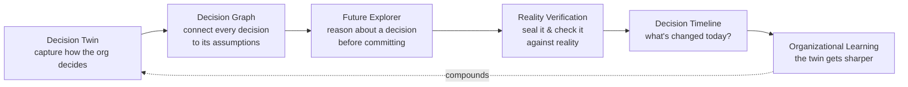
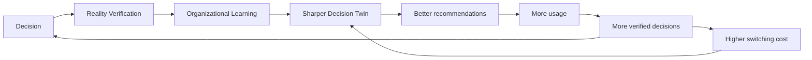
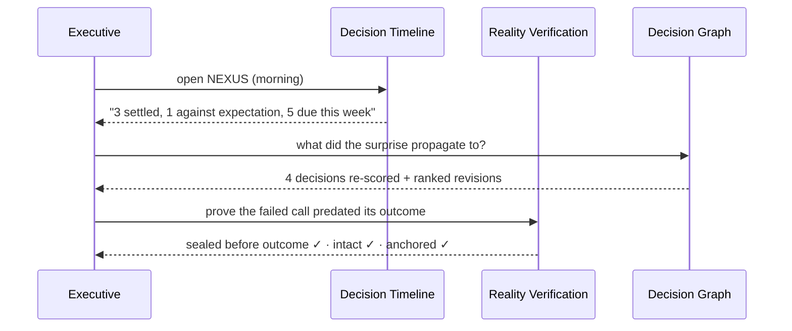
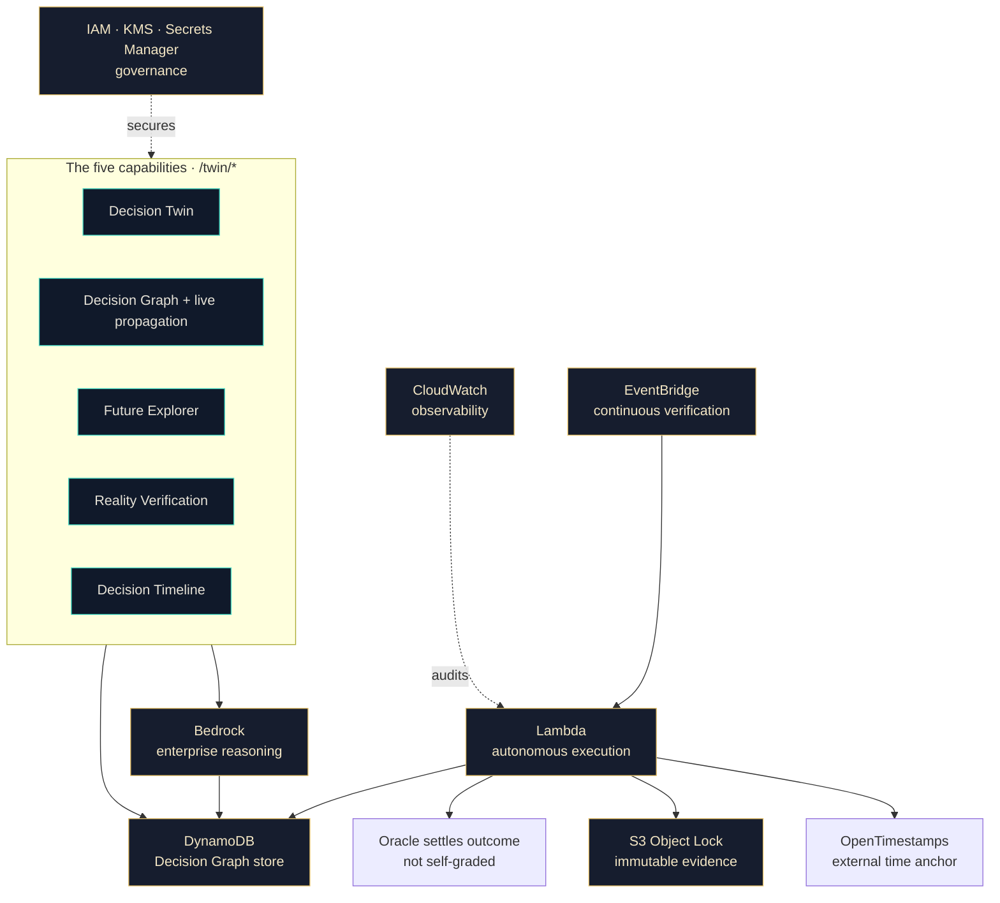
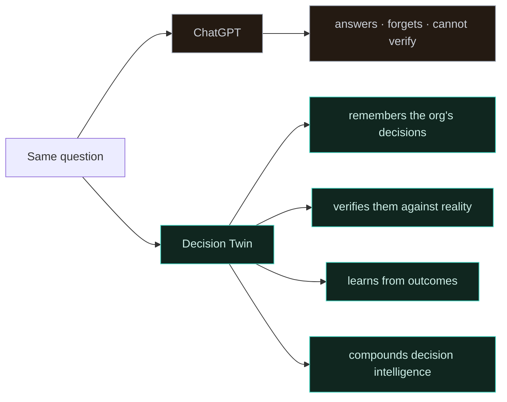

# NEXUS — Diagrams

Professional diagrams for the Decision Twin. They render natively on GitHub (Mermaid).

---

## 1 · The customer journey



---

## 2 · The aha — assumption propagation through the Decision Graph

```mermaid
flowchart TD
    EV[Reality: Brazil demand grew ~6%, not >18%]:::ember --> AS{{Assumption falsified:<br/>"demand grows >18% YoY"}}:::ember
    AS --> D1[Launch Brazil GTM<br/>FAILED]:::fail
    AS --> D2[Mexico expansion<br/>0.59 → 0.09 · impact 63]:::risk
    AS --> D3[São Paulo center<br/>0.68 → 0.39 · impact 38]:::risk
    AS --> D4[LATAM pricing<br/>0.66 → 0.38 · impact 33]:::risk
    AS --> D5[LATAM sales org<br/>0.63 → 0.36 · impact 26]:::risk
    D2 --> R[Ranked revisions +<br/>the twin learns:<br/>falsification rate ↑]:::learn
    D3 --> R
    D4 --> R
    D5 --> R
    AS -. does NOT touch .-> U1[EU data platform<br/>unaffected]:::ok
    AS -. does NOT touch .-> U2[90-day sales motion<br/>unaffected]:::ok
    classDef ember fill:#3a1c16,stroke:#ff7a4d,color:#ffd9c9;
    classDef fail fill:#2a1116,stroke:#ff4d5e,color:#ffd0d6;
    classDef risk fill:#241a12,stroke:#ff7a4d,color:#ffe6d9;
    classDef ok fill:#10261f,stroke:#3fd6c2,color:#cdeee7;
    classDef learn fill:#163b39,stroke:#3fd6c2,color:#bff7ee;
```

---

## 3 · The flywheel



The moat is the compounding record of verified enterprise decisions — not the technology.

---

## 4 · The "what's changed today?" loop (daily habit)



---

## 5 · One-slide AWS architecture (every service earns its place)



> Remove EventBridge + Lambda + S3 Object Lock and the autonomous verify-and-learn loop
> stops. That is why AWS is essential here, not incidental.

---

## 6 · Why not ChatGPT


